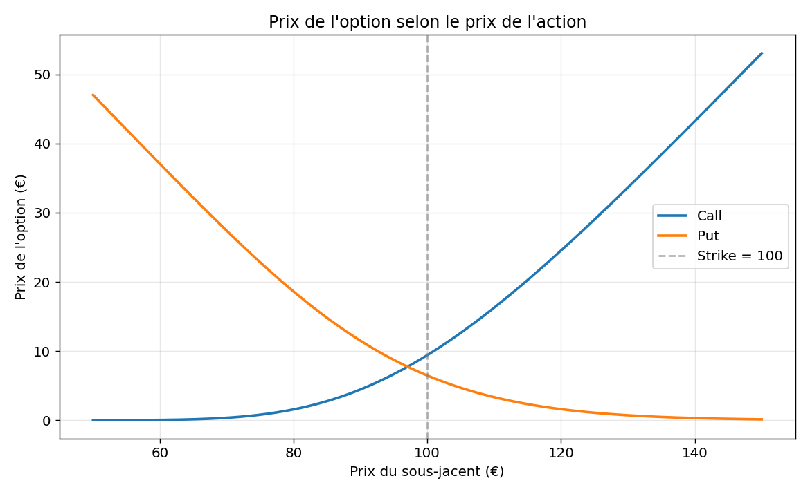
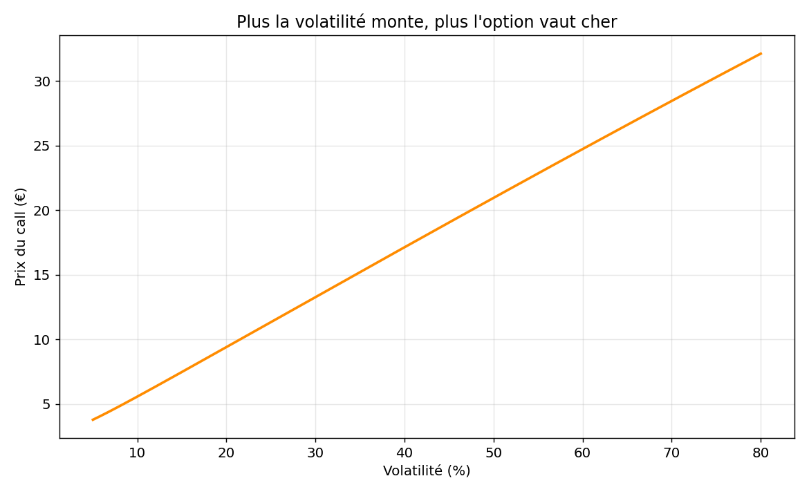
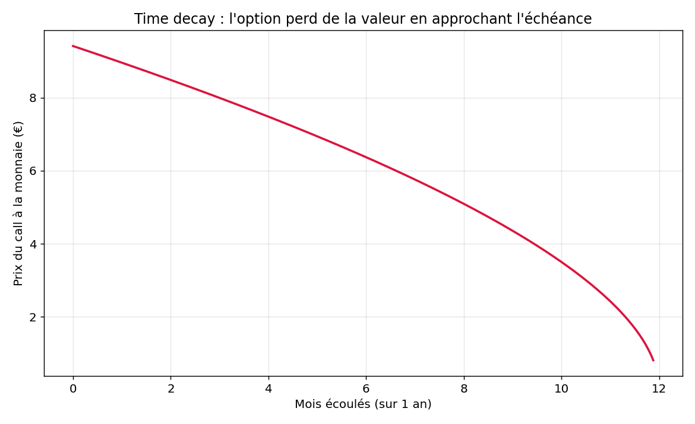
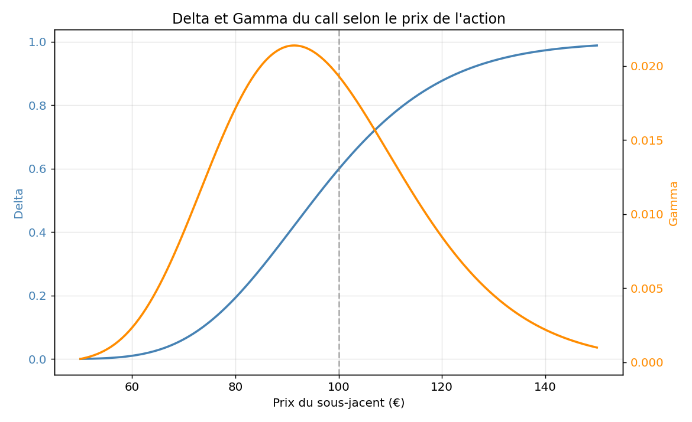

# Black-Scholes — Pricing d'options européennes

Implémentation en Python du modèle de **Black, Scholes & Merton (1973)**, le
papier fondateur du pricing d'options. Le projet recode la formule à partir de
zéro pour comprendre en profondeur le rôle de chaque variable, plutôt que de la
traiter comme une boîte noire.

## Ce que fait le projet

- Pricing d'options d'achat (**call**) et de vente (**put**) européennes
- Calcul des **Greeks** : Delta, Gamma, Vega, Theta, Rho
- Vérification de la **parité call-put** (contrainte d'absence d'arbitrage)
- Quatre **visualisations** qui illustrent le comportement du modèle

## Le modèle

Le prix d'un call est donné par :

```
C = S·N(d1) − K·e^(−rT)·N(d2)
```

avec

```
d1 = [ ln(S/K) + (r + σ²/2)·T ] / (σ·√T)
d2 = d1 − σ·√T
```

| Variable | Signification                          |
|----------|----------------------------------------|
| S        | prix actuel du sous-jacent (l'action)  |
| K        | prix d'exercice (strike)               |
| T        | temps jusqu'à l'échéance (en années)   |
| r        | taux sans risque annualisé             |
| σ (sigma)| volatilité annualisée du sous-jacent   |
| N(·)     | fonction de répartition de la loi normale |

## Installation

\`\`\`bash
pip install -r requirements.txt
\`\`\`

## Utilisation

\`\`\`python
from black_scholes import call_price, delta

# Action à 100€, strike 105€, 1 an, taux 3%, volatilité 20%
prix = call_price(S=100, K=105, T=1, r=0.03, sigma=0.20)
print(f"Prix du call : {prix:.2f} €")   # 7.13 €
\`\`\`

Pour lancer la démonstration complète :

\`\`\`bash
python black_scholes.py      # prix + Greeks + vérification de parité
python visualisations.py     # génère les 3 graphiques
\`\`\`

## Résultats visuels

### 1. Prix de l'option selon le prix de l'action



Le call (bleu) gagne de la valeur quand l'action monte, le put (orange) quand
elle baisse. L'arrondi des courbes près du strike traduit la **valeur temps** :
même proche du strike, l'option garde de la valeur tant qu'il reste du temps
avant l'échéance.

### 2. Prix du call selon la volatilité



Relation croissante : plus le sous-jacent est volatil, plus l'option vaut cher.
C'est le point central du modèle — une option plafonne sa perte à la prime
payée mais garde un fort potentiel de gain, donc la volatilité lui profite.

### 3. Time decay



La valeur d'une option à la monnaie fond avec le temps, et de plus en plus vite
en approchant l'échéance. C'est l'effet du **theta** : chaque jour écoulé réduit
le temps disponible pour qu'un scénario favorable se réalise.

### 4. Delta et Gamma



Le **Delta** (bleu) mesure de combien bouge l'option quand l'action varie de 1€.
Il passe de ~0 (très en-dessous du strike, l'option ne réagit presque pas) à ~1
(très au-dessus, l'option suit l'action comme si on la détenait). Le **Gamma**
(orange) mesure la vitesse de variation du delta : il culmine autour du strike,
là où l'option est la plus sensible.

## Hypothèses du modèle (et ses limites)

Black-Scholes suppose une volatilité constante, pas de dividendes, un marché
sans frictions et un exercice européen uniquement. En pratique, la volatilité
n'est pas constante (d'où le *volatility smile* observé sur les marchés), ce qui
a motivé des modèles plus avancés (Heston, modèles à volatilité locale, etc.).

## Structure

\`\`\`
black-scholes/
├── black_scholes.py     # moteur de pricing + Greeks
├── visualisations.py    # génération des graphiques
├── requirements.txt
└── README.md
\`\`\`

## Référence

Black, F., & Scholes, M. (1973). *The Pricing of Options and Corporate
Liabilities*. Journal of Political Economy, 81(3), 637–654.
